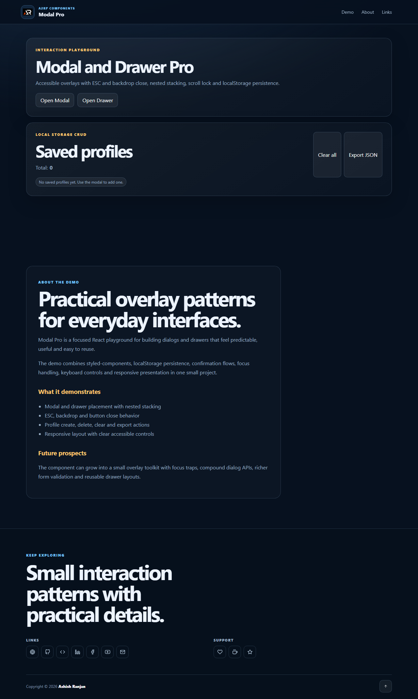

# Modal Pro

A practical React playground for accessible modals and drawers. It demonstrates nested stacking, keyboard and backdrop close behavior, scroll locking, confirmation dialogs and localStorage profile CRUD.

## Features

- Modal and drawer overlays with reusable controls
- ESC, backdrop and button close behavior
- Nested z-index handling and background scroll lock
- Create, delete, clear and export saved profiles
- Responsive fixed header, mobile menu, icon-only footer and go-top control

## Tech stack

- React and Vite
- styled-components and CSS
- React Icons
- React Toastify

## Run locally

```bash
npm install
npm run dev
```

## Deploy

```bash
npm run deploy
```

## Screenshot



## Links

- Live: [https://a2rp.github.io/modal-pro/](https://a2rp.github.io/modal-pro/)
- Repository: [https://github.com/a2rp/modal-pro](https://github.com/a2rp/modal-pro)
- Portfolio: [https://www.ashishranjan.net/](https://www.ashishranjan.net/)
- GitHub: [https://github.com/a2rp](https://github.com/a2rp)
- CodePen: [https://codepen.io/ash1198](https://codepen.io/ash1198)
- LinkedIn: [https://www.linkedin.com/in/aashishranjan](https://www.linkedin.com/in/aashishranjan)
- Facebook: [https://www.facebook.com/theash.ashish/](https://www.facebook.com/theash.ashish/)
- YouTube: [https://www.youtube.com/@ashishranjan-ashz?sub_confirmation=1](https://www.youtube.com/@ashishranjan-ashz?sub_confirmation=1)
- Email: [ash.ranjan09@gmail.com](mailto:ash.ranjan09@gmail.com)

## Support

- Support: [https://a2rp-donation-page.netlify.app/](https://a2rp-donation-page.netlify.app/)
- Buy Me a Coffee: [https://buymeacoffee.com/a2rp](https://buymeacoffee.com/a2rp)
- Patreon: [https://patreon.com/a2rp](https://patreon.com/a2rp)